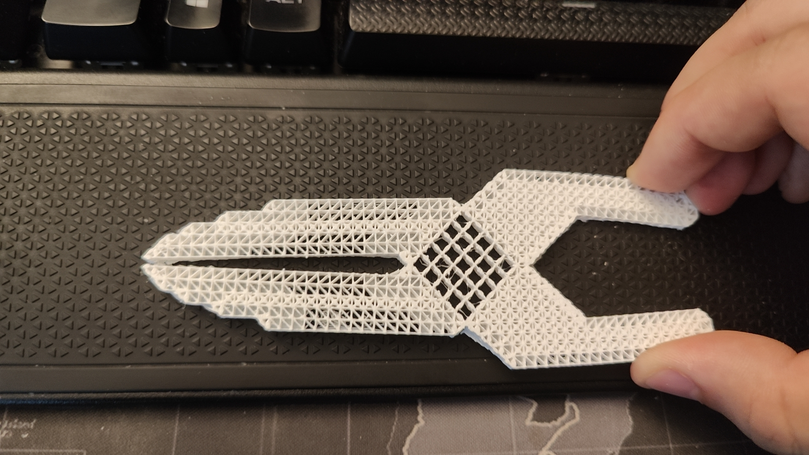



## MetaMaterial Design (Plier)

Designing a plier with meta material!

### Designing cells

Building and adjusting rigid and shear cells

### Building the Plier

Setting stiffness to 50%, we started building plier's main body

### Touching up edges

I noticed that the edges of the plier are not smooth, so we designed triangular cells to smooth the edges

### Slicing and Examing

Due to unknown issue, the edging and interior cells are not connected. I tried to fix the issue by slicing the model in different ways, but the issue still persists.

### 3D Printed Product

Regardless, the printed plier is able to convert the force and firmly grip small objects

